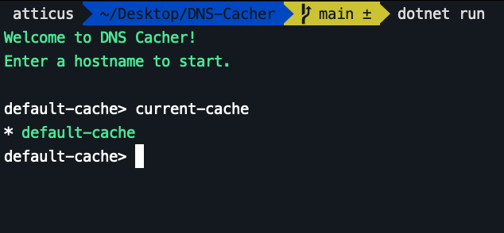
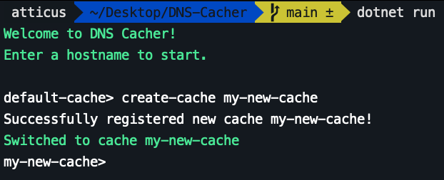
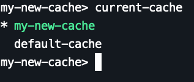
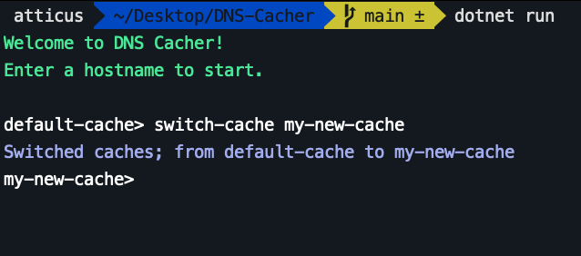
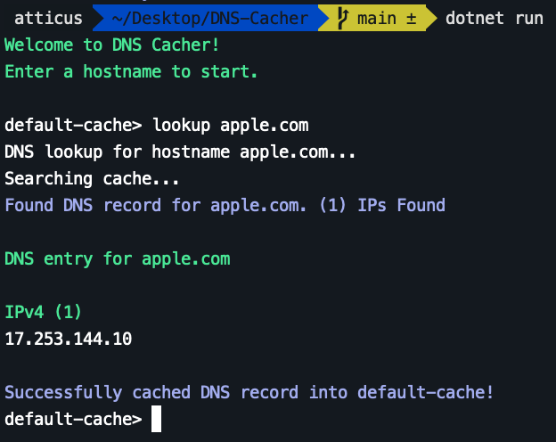

# DNS Cacher
***Description***
> This simple C# program fetches hostnames and looks through domain name servers for A records. When it finds an IP in the DNS, it will cache the IP, DNS, and Hostname, so that when you fetch the same hostname, it will receive the cached results.

<h2>Requirements</h2>
.NET 3.1 or greater

<h2>Running the Program</h2>

<h3>Visual Studio</h3>
Download the source code: <code>git clone https://github.com/SoftwareFuze/DNS-Cacher.git</code> 
Then, open <code>DNS-Cacher.csproj</code> with Visual Studio.

<h3>.NET CLI</h3>
Download the source code: <code>git clone https://github.com/SoftwareFuze/DNS-Cacher.git</code> 
Then, run the command <code>dotnet run</code>

When you run the program, you should see the following message 

<h2>Commands</h2>
<ul>
    <li><a href="#current-cache"><code>current-cache</code></a></li>
    <li><a href="#create-cache"><code>create-cache [name]</code></a></li>
    <li><a href="#switch-cache"><code>switch-cache [cache]</code></a></li>
    <li><a href="#lookup"><code>lookup [hostname]</code></a></li>
</ul>

    <h2>View the current cache</h2>
    
To view the current cache, run the command <code>current-cache</code>

    

    <h2>Create a new cache</h2>
    
To create a new cache, run the command <code>create-cache [name]</code> where <code>[name]</code> is the name of the new cache you want to register.

    
    
Now, as you can see, it switched us over to the newly created cache we made!

    
We now have both our <code>default-cache</code> and our newly created <code>my-new-cache</code>

    

    <h2>Switch from one cache to another</h2>
    
To switch from one cache to another, run the command <code>switch-cache [cache]</code> where <code>[cache]</code> is the name of the cache you want to switch to.

    

    <h2>Lookup a DNS record</h2>
    
To lookup a DNS record by hostname, run the command <code>lookup [hostname]</code> where <code>[hostname]</code> is the hostname.

    <h3>Valid hostnames are the domain name, followed by the TLD.</h3>
    <ul>
        <h3>Examples of valid and invalid hostnames:</h3>
        <li>✅ &nbsp;&nbsp;google.com</li>
        <li>❌ &nbsp;&nbsp;https://google.com/</li>
        <li>✅ &nbsp;&nbsp;apple.com</li>
        <li>❌ &nbsp;&nbsp;apple.com/</li>
    </ul>
    

<h2>To exit the program, run the command <code>.exit</code></h2>